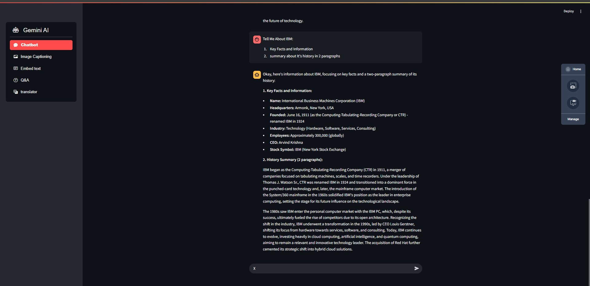
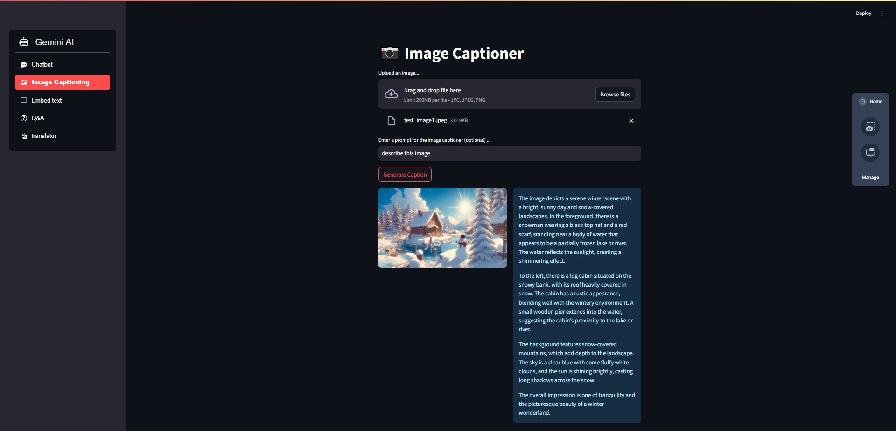
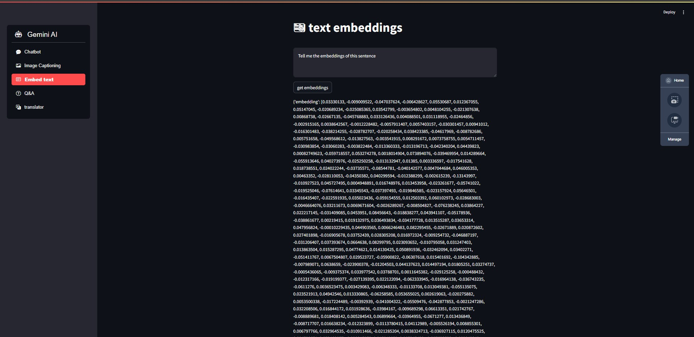
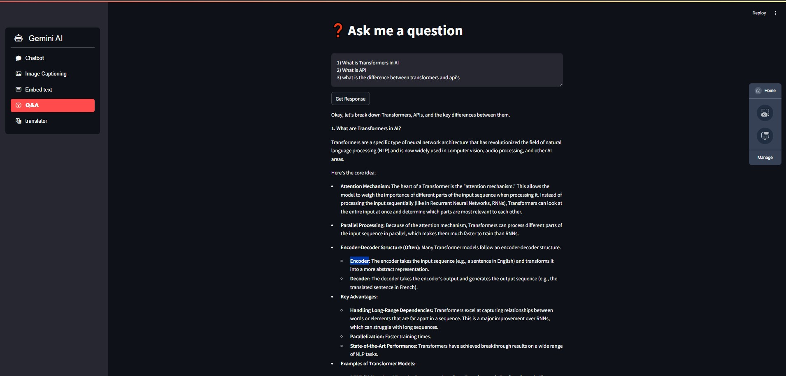
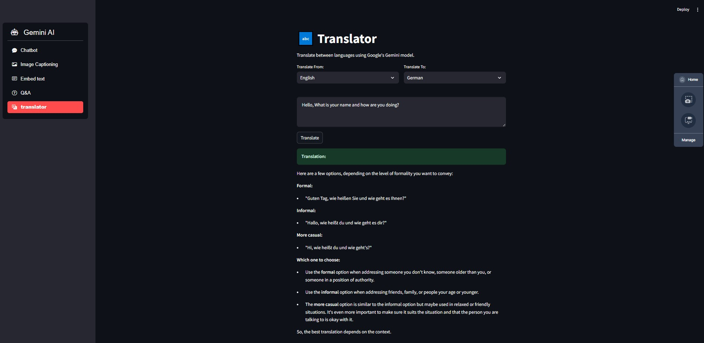

# Gemini AI: Interactive Multi-Task Translator & Chatbot 🤖🌐

## Overview
**Gemini AI** is a personal training project demonstrating the use of the **Google Generative AI API** (Gemini) to build a multi-purpose application. In this project, I built several interactive tools including:
- A **Chatbot** for conversational Q&A.
- An **Image Captioning** feature.
- A tool to **Embed text** and retrieve embeddings.
- A **Translator** for converting text between languages.

This project is built using Python (3.9), Streamlit for the user interface, and modular utility functions that encapsulate API calls to Gemini. All code is organized into dedicated files for clarity and maintainability.

## Key Features
- **Multi-Task Capability:**  
  - **Chatbot:** Engage in interactive Q&A sessions.
  - **Image Captioning:** Generate descriptive captions for uploaded images.
  - **Text Embedding:** Compute vector embeddings for any input text.
  - **Translator:** Translate text between multiple languages using a dropdown menu for source and target languages, with language detection for validation.
  
- **Modular Design:**  
  - **OOP Approach:** The code is organized into multiple files (e.g., `gemini_utility.py`, `main-google-api.py`) for better modularity and reuse.
  - **Custom Utility Functions:** Functions like `load_gemini_model()`, `gemini_image_caption()`, `gemini_embedding()`, `gemini_pro_response()`, and `gemini_translator()` encapsulate the logic for interacting with the Gemini API.
  
- **Engaging User Interface:**  
  - An interactive Streamlit interface that allows users to select the desired function from a sidebar menu.
  - Customizable options for language selection in the translator, as well as clear feedback for input validation using emojis and styled alerts.

## Project Structure
- **gemini_utility.py:**  
  Provides helper functions for:
  - Loading the Gemini generative model for chatbot applications.
  - Generating image captions.
  - Computing text embeddings.
  - Producing Q&A responses.
  - Translating text from one language to another.

- **main-google-api.py:**  
  Contains the main Streamlit application that ties all functionalities together. Key sections include:
  - **Chatbot:** Interactive chat session where users ask questions and receive responses.
  - **Image Captioning:** Users can upload an image, optionally provide a caption prompt, and get a generated caption.
  - **Embed Text:** Returns embeddings of input text.
  - **Q&A:** Users enter a question and receive an answer from Gemini.
  - **Translator:** Lets users select source and target languages from a dropdown, enter a sentence, and get a translation. It also validates the language of the input text using the `langdetect` library.

- **Additional Files (not shown here):**
  - Other project files such as configuration keys (in `keys.py`), notebooks (e.g., `main_notebook.ipynb`) for exploration, etc.

## Technical Details
- **API Integration:**  
  - Uses the [Google Generative AI API](https://github.com/google/generative-ai) to call Gemini’s generative and embedding endpoints.
  - API key is securely loaded from a local keys file (`keys.py`).
  
- **Translation Functionality:**  
  - The `gemini_translator()` function constructs a translation prompt dynamically based on user-selected source and target languages.
  - The function sends this prompt to Gemini and returns the translated text.
  
- **Streamlit Interface:**  
  - The UI is built with [Streamlit](https://streamlit.io/), offering an intuitive sidebar for navigation among tasks.
  - Uses interactive widgets like `selectbox`, `text_area`, and buttons to enhance user experience.
 
  ## 📸 Project Showcase

Get a glimpse of the Gemini AI multi-tool interface in action:

  
  
  

  
  

  
- **Security & Best Practices:**  
  - The code includes appropriate error handling (e.g., language detection failure, input validation).
  - A FutureWarning regarding `torch.load` is addressed in comments and by ensuring trusted checkpoint files are loaded.

